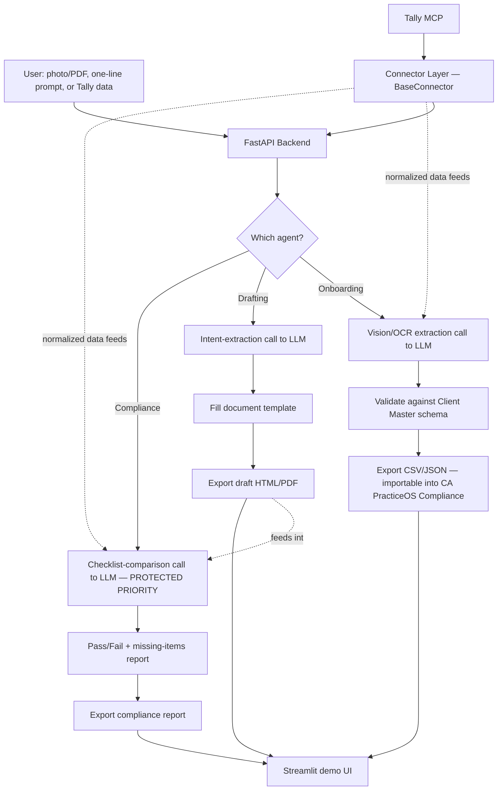

# CLAUDE.md — Read this first, every session

This file is the source of truth for building the **CA PracticeOS Compliance — AI Agent Layer** (AICA Level 2 capstone), compressed to fit a working-professional's schedule with a **hard deadline of Wednesday, September 23**. Read this file fully before writing or changing any code. Do not re-derive the plan from conversation — it's all here, including today's actual date on each step.

## How to work through this project

- **Work one dated session at a time**, exactly as laid out in Section 4. Do not jump ahead, and do not try to build more than one day's scope in a single sitting — sessions here are deliberately short (1–6 hours) because the person building this has a day job and limited usage budget.
- **Start each session by stating which day's date you're on** and what's already done from prior sessions, so context stays small instead of re-reading the whole project every time.
- **Priority order if time runs short — this is the most important rule in this file:**
  1. **Agent 1 (Onboarding)** — foundation, must work
  2. **Agent 3 (Compliance)** — THIS IS THE PRODUCT'S CORE VALUE. This is a compliance product. Never sacrifice this agent's quality or completeness for anything else in this list. If a session is running out of time, protect this agent first, even before Agent 2.
  3. **Agent 2 (Drafting)** — valuable, secondary to Agent 3
  4. **Tally connector** — the first and only thing to cut or simplify if time runs out. Zoho and SAP connectors are **already cut from this build** — do not build them. Mention them only as "designed to extend to" in the project summary, not as working code.
- **Reuse, don't reinvent.** If `/reference/CA_PracticeOS_Mobile.html` is present in this repo, treat its Client Master schema, document field names, and UI patterns as the contract to match — Agent 1's output must plug straight into that existing L1 app's Client Master upload feature.
- **Agent 3 does not depend on Agent 2.** Build and test it against static sample documents (in `/examples/inputs/`) before Agent 2 exists. Don't let Agent 3 wait in a queue behind Agent 2 — get it demonstrably working early (by the Friday session below) so it's safe no matter what happens later in the week.
- **Stop and ask** before making an architecture decision not covered below (e.g. swapping a library, changing the folder structure) rather than guessing.
- **If the Tally sandbox isn't reachable**, don't burn a session debugging network/auth issues in a loop — build against a cached sample JSON response instead and flag it honestly in the docs.

---

# CA PracticeOS Compliance — AI Agent Layer
### AICA Level 2 Capstone Build Plan (compressed, deadline Sept 23)

**Group:** B839-15 · Shubham Mishra, Shiv Kumar Sharma, Shrey Chopra, Sonali Pawar
**Base project:** CA PracticeOS Compliance (AICA Level 1)
**Goal:** Add a real, reasoning AI agent layer on top of the existing browser app — demonstrating Python, agentic AI and app deployment, the three pillars of the AICA L2 syllabus. **The Compliance agent (Agent 3) is the headline feature** — this is a compliance product, and the video/demo should say so explicitly.

---

## 1. Why this project fits the L2 rubric

| L2 skill area | How this project demonstrates it |
|---|---|
| Python | FastAPI backend, document parsing, orchestration logic, one connector adapter |
| Agentic AI | Multi-step perceive → reason → act → validate loop (not a single prompt call) |
| App deployment | Backend deployed on Render/Railway; connected to your existing L1 frontend |
| Third-party integration | Tally connector via ICAI's Tally MCP module — directly from the L2 syllabus |
| Continuity story | Judges see a clear "L1 built the document engine → L2 made it intelligent and connected" arc |
| Product focus | Compliance agent (Agent 3) is positioned as the core value, not a side feature |

---

## 2. Scope — 3 agents + 1 connector, Agent 3 protected

### Agent 1 — Client Onboarding Agent
**Input:** photo/PDF of a PAN card or GST certificate
**Output:** a Client Master row in the exact schema your L1 app already expects (Name, Entity Type, PAN, GSTIN, Address, etc.), ready to import via CA PracticeOS Compliance's existing "Upload Client Master" feature.
**Why it matters:** turns a document into structured data automatically.

### Agent 3 — Compliance Checklist Agent (BUILD THIS SECOND, RIGHT AFTER AGENT 1 — PROTECTED PRIORITY)
**Input:** a drafted document (from Agent 2, or any uploaded/sample doc — does not require Agent 2 to exist)
**Output:** a pass/fail check against a mandatory-clause checklist per document type (e.g. engagement letters must state scope, fees, responsibilities, limitations), with what's missing called out.
**Why it matters:** this is the product's actual differentiator. Demonstrates the agent validating output — a genuine multi-step, self-checking workflow rather than one-shot generation. **Do not simplify or cut this agent under time pressure — cut the Tally connector instead.**

### Agent 2 — Document Drafting Agent (build third)
**Input:** one plain-English line, e.g. *"Prepare an engagement letter for ABC Pvt Ltd for tax audit AY 2025-26, fees ₹50,000"*
**Output:** the agent extracts client name, assignment type, fees, and other parameters, then produces a filled draft (reusing your L1 app's document structure/fields).
**Why it matters:** shows natural-language → structured-action reasoning. Feed its output into Agent 3 to demonstrate the two connecting.

---

## 2A. Data Connector — Tally only (Zoho and SAP are cut from this build)

Build one connector, done well, instead of three done poorly. Use an adapter interface even for one connector, so it's honest architecture, not a hack:

```python
class BaseConnector:
    def authenticate(self, credentials: dict) -> None: ...
    def fetch_clients(self) -> list[dict]: ...
    def fetch_ledgers(self, client_id: str) -> list[dict]: ...
    def fetch_vouchers(self, client_id: str, date_range: tuple) -> list[dict]: ...
    def fetch_invoices(self, client_id: str) -> list[dict]: ...
```

**Tally** connects via ICAI's Tally MCP Server — the exact module the L2 syllabus covers. This is the only connector built in this timeline.

**Zoho Books and SAP are explicitly NOT built.** In the project summary, describe them as "designed to extend to, via the same `BaseConnector` interface" — this shows architectural thinking honestly, without claiming working code that doesn't exist.

**Credential handling — non-negotiable:** all API keys and Tally connection strings go in a `.env` file that is **never committed**. Ship a `.env.example` with placeholder values instead.

---

## 3. Architecture



**Stack**
- **Backend:** Python 3.11, FastAPI
- **LLM:** Claude API — one call per agent step, chained
- **Connector layer:** `BaseConnector` interface; `TallyConnector` (via Tally MCP) only
- **Document parsing:** `pdfplumber` for PDFs; vision-capable LLM call for images (with `pytesseract` as an offline OCR fallback)
- **Demo UI:** Streamlit
- **Bridge to L1 app:** Agent 1 outputs the *exact* CSV/JSON schema your CA PracticeOS Compliance Client Master upload already accepts
- **Deployment:** Render or Railway (free tier)
- **Secrets:** `.env` (gitignored), `.env.example` shipped instead

---

## 4. Session-by-session plan (today: Wednesday, September 16, 2026 → deadline Wednesday, September 23, 2026)

Sessions are short and dated because the builder has a day job. Do not try to compress multiple sessions into one sitting — short focused sessions use less usage budget and produce fewer bugs than one long session.

| Date | Session length | Focus | Deliverable |
|---|---|---|---|
| **Wed 16 Sep** (today) | ~1 hr | Setup | Repo created, requirements.txt, Claude API + Tally MCP sandbox tested, 8–10 sample docs collected — including 2–3 sample drafted documents (some with missing clauses on purpose) so Agent 3 has real test material immediately |
| **Thu 17 Sep** | ~2 hrs | Backend + Agent 1 | FastAPI running; Agent 1 (Onboarding): image/PDF → structured JSON extraction working |
| **Fri 18 Sep** | ~2 hrs | Finish Agent 1, build Agent 3 | Agent 1 validated against Client Master schema. **Agent 3 (Compliance) built and working against sample documents — pass/fail + missing-items report.** This is the protected milestone: by tonight, the product's core feature exists and is safe regardless of what happens over the weekend. |
| **Sat 19 Sep** | ~6 hrs | Agent 2, wired into Agent 3 | Agent 2 (Drafting): prompt → extracted params → filled draft. Feed Agent 2's output into Agent 3 to prove the two connect end to end. |
| **Sun 20 Sep** | ~6 hrs | Tally connector + glue + deploy | `TallyConnector` built end-to-end. All 3 agents + connector wired into one Streamlit UI. Agent 1's CSV import tested live into CA PracticeOS Compliance. Backend + Streamlit deployed to Render/Railway. **If running behind schedule at any point today, simplify or stub the Tally connector first — never touch the agents.** |
| **Mon 21 Sep** | ~2 hrs | Test + fix | Full end-to-end test from a fresh browser/incognito session. Fix whatever deployment broke. Extra scrutiny on Agent 3 specifically — it's the headline feature. |
| **Tue 22 Sep** | ~2–3 hrs | Docs + video prep | Project summary written (mentioning Zoho/SAP as roadmap-only), prompt files exported, README done, connector setup notes written, video script/talking points drafted — script should open by framing this as a **compliance product** and lead with Agent 3, not treat it as one of three equal features. |
| **Wed 23 Sep** (deadline) | ~2–3 hrs, do it early | Video + submit | Record the 5–6 min face+screen video. Package the ZIP. Submit with real margin, not at the last hour. |

---

## 5. Capstone ZIP structure

```
CA_PracticeOS_Compliance/
├── project_summary.pdf          # 1–2 pages: problem, architecture, L1→L2 evolution, learnings
│                                 #   — mention Zoho/SAP as "designed to extend to" (roadmap), not built
├── README.md                    # setup + run instructions
├── .env.example                 # placeholder credentials — never the real ones
├── prompts/
│   ├── onboarding_agent.md
│   ├── drafting_agent.md
│   └── compliance_agent.md      # this is your headline prompt — make sure it's well documented
├── connectors/
│   ├── base_connector.py
│   ├── tally_connector.py       # the only connector actually built
│   └── connector_setup.md       # how to configure Tally MCP; note Zoho/SAP as future adapters
├── examples/
│   ├── inputs/                  # dummy PAN/GST images, sample prompts, sample drafts with deliberate missing clauses
│   └── outputs/                 # resulting JSON, drafted document, compliance report, sample Tally pull
├── src/
│   ├── main.py                  # FastAPI app
│   ├── agents/
│   │   ├── onboarding.py
│   │   ├── drafting.py
│   │   └── compliance.py        # protected priority — keep this well-tested and well-commented
│   ├── requirements.txt
│   └── streamlit_app.py
└── deployment_link.txt          # live URL + video link (unlisted YouTube/Drive)
```

**Video (required):** face + screen, ~5–6 minutes. **Open by framing this as a compliance product** and lead the demo with Agent 3, then show Agent 1 and Agent 2 as supporting pieces, then the Tally connector, then close with the CSV importing into your L1 app.

---

## 6. Risks & how to avoid losing marks

- **Never use real client PAN/GSTIN/ledger data in examples** — dummy but realistically-formatted data only, sandbox Tally account only.
- **Never commit real API keys or Tally connection strings.** `.env` stays out of the ZIP.
- **Offline OCR fallback** (`pytesseract`) in case the live demo loses internet or the vision API rate-limits mid-presentation.
- **Offline fallback for Tally too** — if the sandbox is flaky on demo day, keep a cached JSON response ready.
- **If time runs out anywhere, the cut order is: Tally connector first, then Agent 2 polish, never Agent 3.** Say so honestly in the video if something got cut — evaluators respect an honest scope call more than a shaky live demo.
- **Narrate the agentic loop explicitly** in the video — say out loud "the agent extracts → validates → then acts."
- **Record the video on Wednesday morning, not Wednesday night.** Deadline-day recording is the single most common way a genuinely working project misses submission.

---

## Next steps
Once you're ready to start coding, the very first message to Claude Code should be: **"Read CLAUDE.md and start on the Wed 16 Sep session."**
